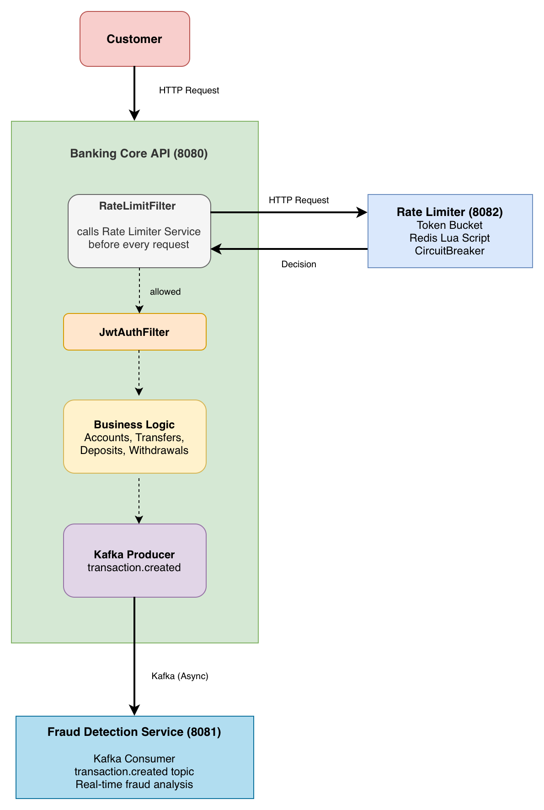

# banking-core-api

A production-grade banking REST API built with **Java 21**, **Spring Boot 3**, and **PostgreSQL**. It implements the backend engineering patterns used in production fintech systems such as double-entry ledger accounting, idempotent transactions, optimistic locking for concurrency safety, and Redis-cached balance derivation.

The service operates within a three-service microservices architecture. It integrates with a standalone Rate Limiter Service for distributed per-user request throttling and functions as an **Event Producer**, broadcasting financial transaction events via **Apache Kafka** to a Fraud Detection Service for asynchronous real-time analysis.

## MicroServices Architecture



> The Rate Limit Filter reads the JWT to identify the user for rate limiting
> purposes but does not validate it. JWT validation occurs in the subsequent
> JwtAuthFilter. Unauthenticated requests fall back to IP-based rate limiting.


## Features

### ✅ Implemented

- **JWT Authentication** — register, login, token validation via `JwtAuthFilter` extending `OncePerRequestFilter`
- **Account Management** — create current accounts, retrieve account details and balances
- **Deposit** — funds flow from `BANK-INTERNAL` account to customer account via double-entry ledger
- **Withdraw** — funds flow from customer account back to `BANK-INTERNAL`
- **Transfer** — peer-to-peer transfers between accounts with ownership validation
- **Double-Entry Ledger** — every operation produces a DEBIT and a CREDIT entry; balance is always calculated from ledger history
- **Transactional Integrity** — `@Transactional` with PENDING → COMPLETED/FAILED status pattern; audit log survives rollback via `REQUIRES_NEW` propagation
- **Exception Handling** — custom exceptions with consistent error responses
- **Transaction History** — paginated endpoint to retrieve ledger entries per account
- **Idempotency Keys** — prevent duplicate transactions on retried requests
- **Optimistic Locking** - prevent race conditions on concurrent transactions
- **Redis Caching** — cache derived balances to avoid full ledger scan on every request
- **Event-Driven Messaging** - Asynchronous publishing of transaction events to Kafka topics with reliable error handling and logging
- **Rate Limiting** — per-user request throttling via a standalone Rate Limiter Service. Integrated through a Spring Security filter before JWT authentication.


### 🚧 Planned


- **Currency Support** — multi-currency accounts with exchange rate handling

---

## Versions

| Version                                                                      | Description                                                                           |
|------------------------------------------------------------------------------|---------------------------------------------------------------------------------------|
| [v0.1.0](https://github.com/visurachan/banking-core-api/releases/tag/v0.1.0) | Core banking features — auth, accounts, deposit, withdraw, transfer, transaction history |
| [v0.2.0](https://github.com/visurachan/banking-core-api/releases/tag/v0.2.0) | Idempotency keys for deposit, withdraw and transfer                                   |
| [v0.3.0](https://github.com/visurachan/banking-core-api/releases/tag/v0.3.0) | Optimistic locking implemented                                                        |
| [v0.4.0](https://github.com/visurachan/banking-core-api/releases/tag/v0.4.0) | Redis caching for balance derivation                                                  |
| [v0.5.0](https://github.com/visurachan/banking-core-api/releases/tag/v0.5.0) | Kafka Integration - Asynchronous event production for transactions                    |
| [v0.6.0](https://github.com/visurachan/banking-core-api/releases/tag/v0.6.0) | Rate limiting integration via standalone Rate Limiter Service                                                                                      |


---

## Tech Stack for core API

| Layer            | Technology           |
|------------------|----------------------|
| Language         | Java 21              |
| Framework        | Spring Boot 3.5      |
| Security         | Spring Security, JWT |
| Database         | PostgreSQL           |
| Migrations       | Flyway               |
| Containerisation | Docker Compose       |
| Build Tool       | Maven                |
| Utilities        | Lombok               |
| Message Broker   | Apache Kafka         |

---

## Architecture Decisions

**Double-entry ledger over a balance column**
Balance is never stored — it is derived by summing ledger entries (`SUM(credits) - SUM(debits)`). This gives a full, immutable audit trail and is how real banking cores work.

**PENDING → COMPLETED/FAILED transaction log pattern**
Before any ledger writes, a `PENDING` transaction log is saved. If the operation succeeds, it is promoted to `COMPLETED`. If anything fails, the catch block marks it `FAILED`. This ensures every attempted transaction is recorded regardless of outcome.

**`REQUIRES_NEW` propagation on `TransactionLogService`**
The transaction log is saved and updated in its own independent database transaction. This means even if the outer `@Transactional` rolls back (e.g. a failed ledger write), the audit log entry survives. The ledger stays consistent; the audit trail is never lost.

**Manual `JwtAuthFilter` over Spring's default**
A custom `OncePerRequestFilter` extracts email and role from the JWT and sets the `SecurityContext` directly. This keeps the auth flow explicit, testable, and free of `UserDetailsService` overhead for stateless token validation.

**Feature-based packaging**
Code is organised by domain (`account`, `auth`, `transaction`) rather than layer (`controller`, `service`, `repository`). This scales better and makes each feature self-contained.

**Idempotency keys for safe retries**
Every mutating endpoint (deposit, withdraw, transfer) requires a client-generated `Idempotency-Key` header. The key and response are stored in a dedicated `idempotency_keys` table on first processing. Subsequent requests with the same key within 24 hours return the cached response without reprocessing. This prevents duplicate transactions caused by network retries or client-side errors.

**Idempotency key stored only on success**
The idempotency key is stored inside the `try` block after all ledger writes succeed. If the transaction fails, the key is never stored — allowing the client to retry with the same key and have it processed as a fresh request.

**Optimistic locking for concurrent transaction safety**
The `Account` entity uses a `@Version` field managed by Hibernate. On every transaction, Hibernate appends `AND version=?` to the UPDATE query. If two concurrent requests attempt to modify the same account simultaneously, the second write will match 0 rows and throw `ObjectOptimisticLockingFailureException`, which is caught by the global exception handler and returned as `409 CONFLICT`. This prevents race conditions without the performance cost of pessimistic locking.

**Receiver only sees completed transactions**
Failed transactions are visible only to the sender — they need to know their transfer failed. Receivers only see COMPLETED transactions since a failed transfer means money never arrived, making the record meaningless from their perspective.

**Redis caching for balance derivation**
Account balance is derived from ledger entries on cache miss and stored in Redis with a 24 hour TTL using the key `balance::{accountNumber}`. On every transaction the cache is invalidated after all DB writes succeed, ensuring the next balance read recalculates from the ledger and caches the fresh value. This avoids a full ledger scan on every request as the transaction history grows.

**Asynchronous Event Production for Decoupling**
Instead of the Core API calling other services (like Notifications or Fraud) directly via REST, it publishes a TransactionCreatedEvent to Kafka. This ensures the Core API remains fast and highly available; even if the Fraud service is down, the transaction still completes, and the event is processed whenever the consumer comes back online.

---


## 🔗 Related Services

This API is the core of a three-service microservices banking system.
It communicates with two downstream services — one synchronously via
HTTP before each request, and one asynchronously via Kafka after each transaction.

* **[Rate Limiter Service](https://github.com/visurachan/rate-limiter)**
  — A standalone distributed rate limiting microservice. Integrated via a Spring
  Security filter that runs before JWT authentication on every request. Enforces
  a limit of 20 requests per user with a refill rate of 5 tokens per second using
  a Token Bucket algorithm executed atomically in Redis.

* **[Fraud Detection Service](https://github.com/visurachan/fraud-detection-service)**
  — A real-time Kafka consumer that listens to the `transaction.created` topic and
  analyses transaction patterns to flag suspicious activity. Runs asynchronously —
  the banking API never waits for fraud analysis, keeping transfer latency unaffected.
---
## Getting Started

### Prerequisites

- Java 21
- Docker & Docker Compose
- Maven

### Run Locally

```bash
# Clone the repo
git clone https://github.com/visurachan/banking-core-api.git
cd banking-core-api

# Start PostgreSQL
docker-compose up -d

# Run the application
./mvnw spring-boot:run
```

### Environment Variables

Create an `application.yml` file in `src/main/resources`:

```yaml
spring:
  datasource:
    url: jdbc:postgresql://localhost:5433/banking_db
    username: your_db_user
    password: your_db_password
  data:
    redis:
      host: localhost
      port: 6379
  kafka:
    bootstrap-servers: localhost:9092
    producer:
      key-serializer: org.apache.kafka.common.serialization.StringSerializer
      value-serializer: org.springframework.kafka.support.serializer.JsonSerializer

jwt:
  secret: your_base64_encoded_secret
  expiration: 86400000
```

Also make sure your `docker-compose.yml` is running both PostgreSQL and Redis before starting the application.

---

## API Documentation

Interactive API documentation is available via Swagger UI when running locally:

**URL:** `http://localhost:8080/swagger-ui.html`

All endpoints are documented with request/response schemas and can be tested directly from the browser. Protected endpoints require a Bearer token — use the `/auth/login` response token and click **Authorize** in the Swagger UI.

## API Endpoints

### Auth — `/api/v1/auth`

| Method | Endpoint | Auth | Description |
|---|---|---|---|
| POST | `/register` | Public | Register a new user |
| POST | `/login` | Public | Login and receive JWT |

### Accounts — `/api/v1/account`

| Method | Endpoint | Auth | Description |
|---|---|---|---|
| POST | `/newCurrentAccount` | Bearer Token | Create a new current account |
| GET | `/myAllAccounts` | Bearer Token | Get all accounts for logged-in user |
| GET | `/accountDetails?accountNumber=` | Bearer Token | Get details for a specific account |

### Transactions — `/api/v1/account`

| Method | Endpoint                       | Auth    | Description                       |
|--------|--------------------------------|---------|-----------------------------------|
| POST   | `/deposit`                     | Public  | Deposit funds into an account     |
| POST   | `/withdraw`                    | Public  | Withdraw funds from an account    |
| POST   | `/{myAccountNumber}/transfer`  | Bearer Token | Transfer funds to another account |
| GET    | `/{accountNumber}/transactions` | Bearer Token | Get paginated transaction history |

> **Note:** Deposit and withdraw are intentionally public endpoints. In a real banking system,
> these operations are  triggered by internal systems such as ATMs, teller terminals, or core banking
> infrastructure rather than directly by the end user via online banking. Transfer is user initiated and therefore requires authentication.

---

## Rate Limiting Integration

Rate limiting is implemented via the [Rate Limiter Service](https://github.com/visurachan/rate-limiter)
SDK. The SDK wraps the HTTP call to the rate limiter into a single method,
integrated as a Spring Security filter that runs before JWT authentication.

```java
RateLimiterClient.Result result = rateLimiterClient.check("banking", jwt);
if (!result.allowed()) {
    response.setStatus(429);
    return;
}
```

For full integration details see the
[Rate Limiter SDK Integration Guide](https://github.com/visurachan/rate-limiter/blob/main/docs/SDK_INTEGRATION.md).

## Project Status


All core features are complete and production-ready. The service implements double-entry ledger accounting, idempotent transactions, optimistic locking, Redis-cached balance derivation, Kafka event production, and distributed rate limiting via an integrated standalone Rate Limiter Service.